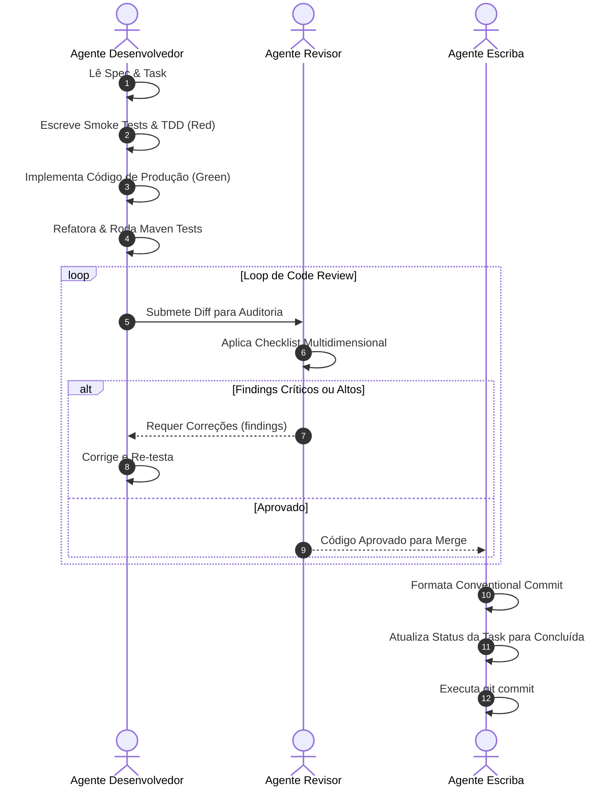

# Orquestrador de Task — Pipeline Sequencial (Projeto TCC)

Este workflow automatiza o ciclo completo de execução de uma tarefa individual, garantindo qualidade antes do commit.

## Entrada

O usuário indicará a tarefa a ser executada (ex: *"Execute a pipeline para `docs/tasks/task-01-database-migration.md`"*).

## Fluxo Automatizado da Esteira

---

### Passo 1: Desenvolvedor (TDD & Implementação)
1. Carregue o workflow `.agents/workflows/developer.md`.
2. Escreva os testes unitários e smoke tests primeiro.
3. Implemente a regra de negócio e código de produção.
4. Valide a compilação e os testes com Maven (`mvn test`).

### Passo 2: Revisor (Code Review)
5. Carregue o workflow `.agents/workflows/reviewer.md`.
6. Avalie o checklist (Clean Code, Spring Boot, Postgres, RabbitMQ, Segurança, Cobertura).
7. Se reprovado por itens Críticos ou Altos, retorne ao Passo 1 até obter **Aprovado**.

### Passo 3: Escriba (Commit Semântico)
8. Carregue o workflow `.agents/workflows/commit.md`.
9. Atualize o status da task em `docs/tasks/` para **Concluída**.
10. Execute o commit semântico.
