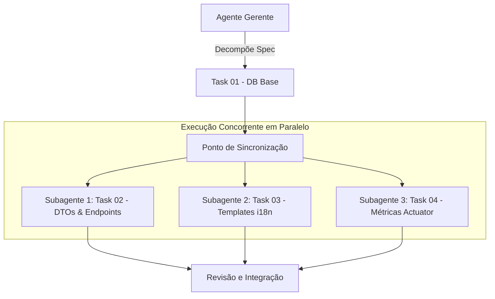
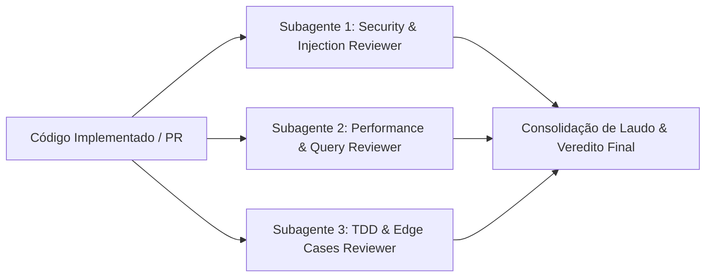

# Orquestrador Paralelo — Parallel Multi-Agent Pipeline (Projeto TCC)

Este workflow orienta e estrutura a execução de **agentes em paralelo**, acelerando o desenvolvimento e aprofundando as auditorias de qualidade.

---

## ⚡ Modos de Execução em Paralelo

### Modo 1: Tasks Independentes em Paralelo (Múltiplos Desenvolvedores)
Quando uma funcionalidade é quebrada em tarefas desacopladas (ex: `task-02-relatorios-pdf` e `task-03-i18n-espanhol`), elas podem ser disparadas concorrentemente.



#### Regras para Paralelização de Tasks:
1. **Sem Dependências Circulares**: Apenas dispare em paralelo tarefas cujos arquivos de saída não colidam diretamente.
2. **Isolamento de Contexto**: Cada subagente recebe seu arquivo de task individual e roda de forma independente.
3. **Sincronização Final**: Após o retorno de todos os subagentes paralelos, a suíte de testes global (`mvn test`) é executada para garantir integridade.

---

### Modo 2: Banca de Revisores Especializados em Paralelo (Multi-Agent Review)
Para entregas críticas de arquitetura, segurança ou motor MMEEBB, disparamos **3 subagentes de revisão simultaneamente**:



1. **Revisor 1 (Segurança & Resiliência)**: Analisa sanitização, injeção SQL/JPQL, exposição de tokens, tratamento de exceções e rate-limiting.
2. **Revisor 2 (Performance & Spring Data)**: Analisa queries N+1, isolamento de transações `@Transactional`, índices de banco e pools de conexão.
3. **Revisor 3 (Qualidade de Testes & TDD)**: Analisa cobertura de branches, asserts significativos, mocks precisos e ausência de testes *flaky*.

---

## 🛠️ Como Invocar no Antigravity

No Antigravity, a chamada paralela é realizada diretamente passando múltiplos subagentes no array `Subagents`:

```json
{
  "Subagents": [
    {
      "Role": "Security Auditor",
      "TypeName": "research",
      "Prompt": "Audite os arquivos modificados em busca de vulnerabilidades de segurança e injeção."
    },
    {
      "Role": "Performance Auditor",
      "TypeName": "research",
      "Prompt": "Audite as consultas Spring Data e repositórios em busca de queries N+1 e gargalos."
    },
    {
      "Role": "QA Test Specialist",
      "TypeName": "research",
      "Prompt": "Verifique a cobertura dos testes unitários criados e casos de borda não tratados."
    }
  ]
}
```

---

## 🚀 Como Executar via Script Python

Para execução em lote paralela via terminal:
```bash
# Executar tasks 2 a 4 em paralelo com 3 workers simultâneos
python scripts/run_parallel_tasks.py 2 4 --concurrency 3
```
