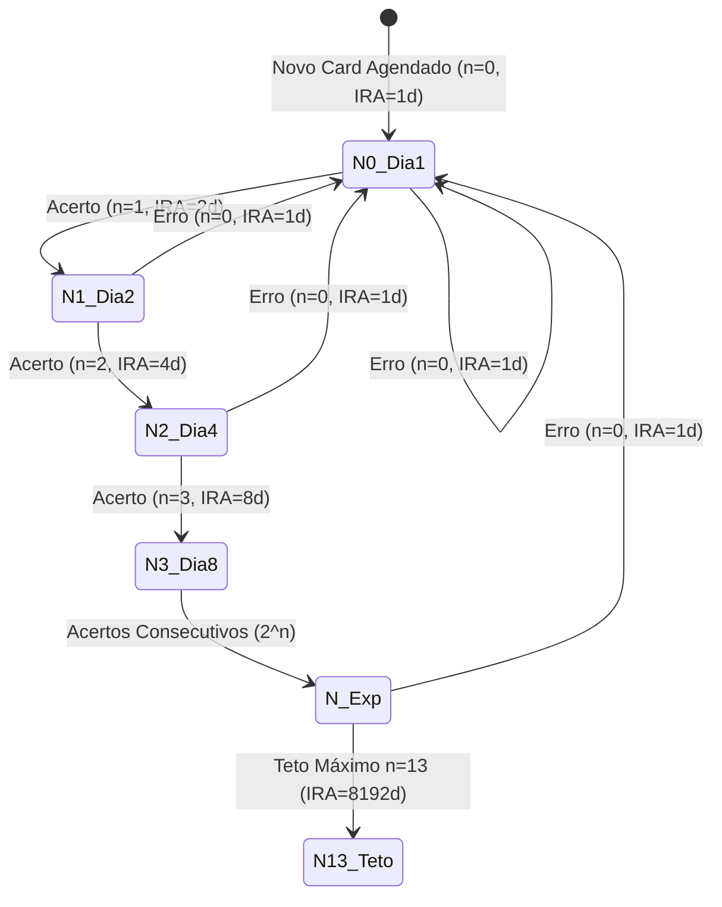
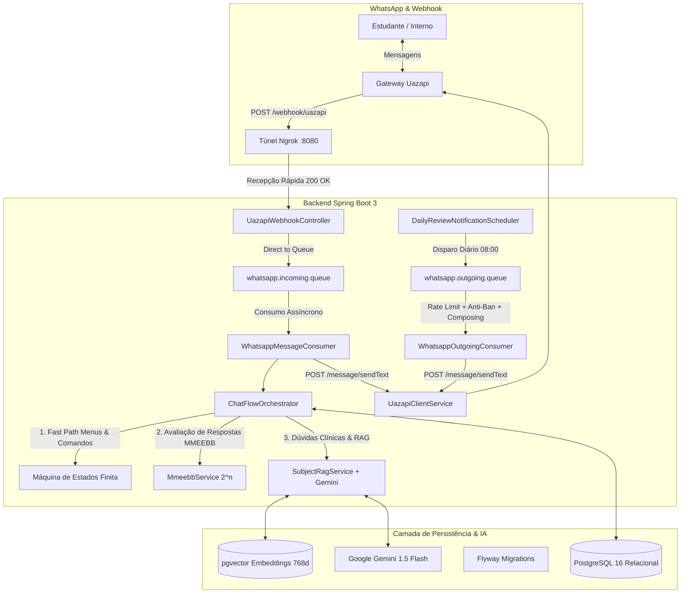
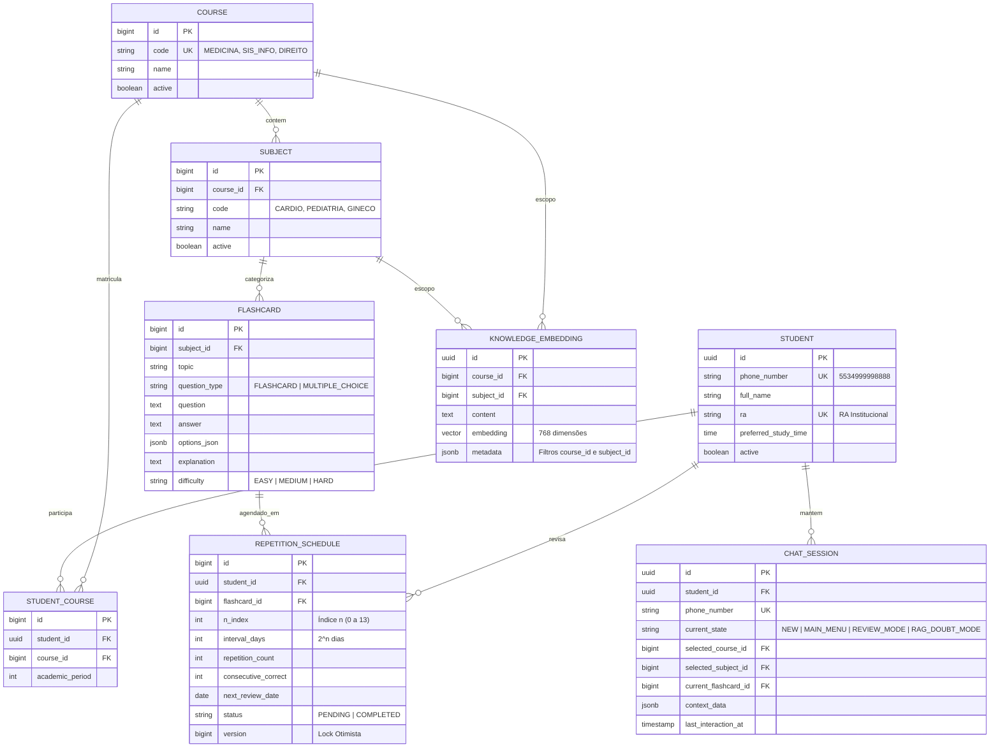

<div align="center">

# 🧠 Chatbot de Repetição Espaçada MMEEBB
### *Automação da Memorização Exponencial na Base Binária para Educação Médica e Superior*

[](https://openjdk.org/)
[](https://spring.io/projects/spring-boot)
[](https://github.com/pgvector/pgvector)
[](https://www.rabbitmq.com/)
[](https://ai.google.dev/)
[](https://github.com/langchain4j/langchain4j)
[](https://junit.org/junit5/)

---

**Trabalho de Conclusão de Curso (TCC)**  
**Instituição:** Centro Universitário de Patos de Minas ([UNIPAM](https://unipam.edu.br))  
**Curso:** Bacharelado em Sistemas de Informação  
**Autor:** Níckolas Tavares do Nascimento  
**Orientadora:** Profa. Dra. Mislene Dalila da Silva  

</div>

---

## 📌 Sumário
- [1. Visão Geral e Problema](#1-visão-geral-e-problema)
- [2. Fundamentação Teórica](#2-fundamentação-teórica)
- [3. O Algoritmo MMEEBB ($2^n$)](#3-o-algoritmo-mmeebb-2n)
- [4. Arquitetura da Solução](#4-arquitetura-da-solução)
- [5. Modelagem de Dados & DER](#5-modelagem-de-dados--der)
- [6. Stack Tecnológica](#6-stack-tecnológica)
- [7. Como Executar o Projeto](#7-como-executar-o-projeto)
- [8. Variáveis de Ambiente](#8-variáveis-de-ambiente)
- [9. Integração com WhatsApp (Uazapi & Ngrok)](#9-integração-com-whatsapp-uazapi--ngrok)
- [10. Suíte de Testes (TDD)](#10-suíte-de-testes-tdd)
- [11. Estrutura do Código](#11-estrutura-do-código)
- [12. Governança Git & Commits Semânticos](#12-governança-git--commits-semânticos)

---

## 1. Visão Geral e Problema

Estudantes de graduações densas — em especial os cursos de **Medicina** durante as fases de **Internato e Residência Médica** — enfrentam jornadas exaustivas que ultrapassam 40 a 60 horas semanais. Essa rotina gera dois desafios críticos:
1. **Sobrecarga Cognitiva e Fadiga:** Dificuldade extrema em encontrar tempo dedicado para abrir aplicativos tradicionais de estudo (como Anki ou flashcards manuais).
2. **Declínio Rápido da Retenção:** Conhecimentos clínicos e diagnósticos complexos são rapidamente esquecidos se não forem reforçados ativamente em intervalos matematicamente dosados.

Este projeto propõe e implementa um **Chatbot Inteligente no WhatsApp** que automatiza o agendamento de revisões ativas com o método **MMEEBB**, atua como um **Preceptor/Tutor Médico Virtual via IA Generativa (Google Gemini + RAG)** e elimina toda a fricção de uso ao entregar os questionamentos diretamente no canal de comunicação mais acessado pelo estudante.

---

## 2. Fundamentação Teórica

O projeto fundamenta-se na convergência de três pilares científicos e comportamentais:

```mermaid
graph LR
    A[<b>Nelson Cowan (2001)</b><br/>Limite de Memória de Trabalho<br/>~4 chunks simultâneos] --> D[<b>Chatbot MMEEBB</b><br/>Interação em doses pílulas no WhatsApp]
    B[<b>Hermann Ebbinghaus (1885)</b><br/>Curva do Esquecimento<br/>Perda exponencial sem reforço] --> D
    C[<b>BJ Fogg (2009)</b><br/>Modelo Comportamental<br/>B = MAT: Gatilho Ativo sem Atrito] --> D
```

1. **A Capacidade Mágica de Cowan (2001):** Demonstra que a atenção humana imediata comporta apenas $\approx 4$ blocos (*chunks*) de informação. O chatbot envia pílulas clínicas diárias que respeitam essa barreira cognitiva.
2. **A Curva do Esquecimento de Ebbinghaus (1885):** Mostra que a retenção cai drasticamente nas primeiras horas após o aprendizado. Revisões espaçadas ativas achatam a curva e consolidam as memórias de longo prazo.
3. **O Modelo Comportamental de BJ Fogg (2009) ($B = M \times A \times T$):** Um comportamento ($B$) só ocorre quando há Motivação ($M$), Habilidade/Facilidade ($A$) e Gatilho (*Trigger* - $T$). O chatbot atua como o **Gatilho Ativo (Push Notification)** dentro do WhatsApp, reduzindo o esforço do aluno a quase zero.

---

## 3. O Algoritmo MMEEBB ($2^n$)

O sistema utiliza o **Método de Memorização Exponencial Efetivo na Base Binária** (Ferreira et al., 2014):

### Fórmula do Intervalo de Reforço de Aprendizado (IRA):
$$\text{IRA} = 2^n \text{ dias}, \quad \text{onde } n \in [0, 13]$$



- **Início ($n = 0$):** O primeiro reforço ocorre $2^0 = 1$ dia após o contato com o conteúdo.
- **Acerto (Feedback Positivo):** O índice $n$ avança uma posição ($n \leftarrow \min(n+1, 13)$), dobrando o intervalo ($1 \to 2 \to 4 \to 8 \to 16 \dots$ dias).
- **Erro (Feedback Negativo):** O índice é resetado ($n \leftarrow 0$), retornando imediatamente para a fila de revisão do dia seguinte ($2^0 = 1$ dia).

---

## 4. Arquitetura da Solução

O sistema foi concebido sob o padrão **Direct-to-Queue Messaging** e **Arquitetura em Camadas Enterprise**, garantindo isolamento assíncrono, proteção contra sobrecargas e tolerância a falhas.



### 4.1. Máquina de Estados Finita (FSM) & Comandos Conversacionais

O fluxo conversacional é gerenciado por uma **FSM determinística** (`ChatFlowOrchestrator`) com separação clara de intenções:

| Intenção / Ação | Gatilhos Aceitos | Comportamento no WhatsApp |
| :--- | :--- | :--- |
| **👋 Saudações & Ajuda** | `ola`, `olá`, `oi`, `bom dia`, `boa tarde`, `boa noite`, `ajuda`, `help`, `opções` | Envia as boas-vindas ou reexibe as orientações do sistema. |
| **📋 Menu Principal** | `menu`, `inicio`, `início`, `começo`, `reset`, `/menu`, `/start` | Reseta a sessão para o estado `MAIN_MENU` e exibe o menu com as opções de estudo. |
| **📚 1 - Revisão MMEEBB** | `1`, `revisar`, `revisão`, `questão`, `estudar` | Inicia o ciclo de flashcards pendentes do dia ($2^n$). |
| **💡 2 - Modo Dúvidas (RAG)** | `2`, `duvidas`, `dúvidas`, `rag`, perguntas livres | Consulta a base vetorial (`pgvector`) com LangChain4j + Gemini e responde dúvidas do material. |
| **🔄 3 - Trocar Disciplina** | `3`, `trocar`, `curso`, `disciplina` | Permite alternar o curso e a disciplina ativa de estudo. |
| **🚪 Encerramento (Exit Intent)** | `sair`, `tchau`, `encerrar`, `finalizar`, `fim`, `até mais`, `flw`, `adeus`, `/sair` | **Finaliza a sessão com mensagem amigável de despedida** e limpa cards ativos, sem reenviar o menu em loop. |

---

## 5. Modelagem de Dados & DER

O banco de dados adota modelagem dinâmica multi-curso e multi-disciplina, particionando embeddings vetoriais para evitar cruzamento indevido de conteúdos no módulo RAG:



---

## 6. Stack Tecnológica

| Componente | Tecnologia | Finalidade |
| :--- | :--- | :--- |
| **Backend** | Java 17 + Spring Boot 3.3.x | Core da aplicação e regras de negócio |
| **Banco Relacional** | PostgreSQL 16 | Persistência transacional das entidades e agendamentos |
| **Banco Vetorial** | `pgvector` (PostgreSQL extension) | Armazenamento de embeddings semânticos para o RAG |
| **Migrations** | Flyway | Versionamento e automação do schema SQL |
| **Mensageria** | RabbitMQ 3 Management | Desacoplamento assíncrono, buffers e proteção anti-ban |
| **IA / LLM & RAG** | Google Gemini 1.5 Flash + LangChain4j | Preceptor clínico, classificação semântica e RAG |
| **Parser Universal** | Apache Tika | Extração de texto de PDFs, DOCX e Markdown para ingestão |
| **Gateway WhatsApp** | Uazapi / UazapiGO | Conexão com o WhatsApp, webhooks e envio de mensagens |
| **Túnel Local** | Ngrok | Exposição segura da porta `8080` para recepção de eventos |
| **Testes** | JUnit 5, Mockito, Spring Test | Metodologia TDD com 100% de cobertura de serviços |

---

## 7. Como Executar o Projeto

### Pré-requisitos
- [Docker e Docker Compose](https://www.docker.com/)
- [Java Development Kit (JDK 17+)](https://adoptium.net/)
- [Ngrok CLI](https://ngrok.com/download)

### Passo 1: Subir os Containers Docker
Na raiz do repositório, execute:
```powershell
docker compose up -d
```
> Isso iniciará o **PostgreSQL 16 com pgvector** na porta `5432` e o **RabbitMQ** nas portas `5672` (AMQP) e `15672` (Painel Web: [http://localhost:15672](http://localhost:15672)).

### Passo 2: Configurar Variáveis de Ambiente (.env) e Rodar o Backend
Copie o modelo de ambiente ou edite o arquivo `.env` na raiz do projeto:
```powershell
Copy-Item .env.example .env
```
Preencha suas chaves no `.env`:
```properties
# Google Gemini (Chave gratuita em: https://aistudio.google.com/app/apikey)
GEMINI_API_KEY=sua_chave_gemini_aqui
GEMINI_MODEL_NAME=gemini-3.5-flash
GEMINI_EMBEDDING_MODEL_NAME=gemini-embedding-001

# Chave de Administração REST
ADMIN_API_KEY=teste

# Gateway Uaizap
UAZAPI_BASE_URL=https://free.uazapi.com
UAZAPI_API_KEY=sua_chave_uazapi
UAZAPI_INSTANCE=sua_instancia
```

Em seguida, inicialize a aplicação:
```powershell
.\mvnw.cmd spring-boot:run
```

> **💡 Dica de Custo/Performance com Google Gemini:**  
> O modelo padrão configurado é o **`gemini-3.5-flash`** (ou `gemini-3.6-flash`), a geração mais moderna, econômica e de altíssima velocidade do Google. Para a geração de vetores semânticos do RAG, utilizamos o modelo oficial **`gemini-embedding-001`** configurado com `outputDimensionality: 768` (dimensões compatíveis com o índice HNSW do pgvector).

### Passo 3: Sincronizar Flashcards e Questões no RAG (pgvector)
Para que o tutor virtual responda a qualquer dúvida clínica ou técnica no WhatsApp com base no acervo de mais de 85 questões cadastradas, execute a sincronização via endpoint administrativo:

```powershell
curl.exe -i -X POST "http://localhost:8080/api/admin/rag/sync-flashcards" -H "X-API-KEY: teste"
```
*(Ou passe `?courseId=1` ou `?subjectId=1` para sincronizar uma disciplina específica).*

### Passo 4: Expor a Porta Local via Ngrok
Em um terminal separado:
```powershell
ngrok http 8080
```
Copie a URL pública HTTPS gerada (ex: `https://xxxx.ngrok-free.app`).

### Passo 5: Configurar o Webhook na Uazapi
No painel da Uazapi, configure:
- **Webhook URL:** `https://xxxx.ngrok-free.app/webhook/uazapi`
- **Eventos:** `messages.upsert` (ou `messages`)

---

## 8. Variáveis de Ambiente

| Variável | Valor Padrão | Descrição |
| :--- | :--- | :--- |
| `SPRING_DATASOURCE_URL` | `jdbc:postgresql://localhost:5432/mmeebb_db` | URL de conexão com o PostgreSQL |
| `SPRING_DATASOURCE_USERNAME` | `postgres` | Usuário do banco de dados |
| `SPRING_DATASOURCE_PASSWORD` | `postgres` | Senha do banco de dados |
| `SPRING_RABBITMQ_HOST` | `localhost` | Host do RabbitMQ |
| `SPRING_RABBITMQ_PORT` | `5672` | Porta AMQP do RabbitMQ |
| `UAZAPI_BASE_URL` | `https://free.uazapi.com` | URL base do gateway da Uazapi |
| `UAZAPI_API_KEY` | *(Vazio)* | Token/Chave de autenticação da Uazapi |
| `UAZAPI_INSTANCE` | *(Vazio)* | Nome da instância do WhatsApp conectada |
| `UAZAPI_TYPING_DELAY_MS` | `2000` | Delay simulado de digitação (*composing*) |
| `GEMINI_API_KEY` | *(Vazio)* | Chave de API do Google AI Studio (Gemini) |
| `GEMINI_MODEL_NAME` | `gemini-1.5-flash` | Modelo de IA para RAG e Tutor Clínico (mais econômico) |
| `ADMIN_API_KEY` | `teste` | Chave de segurança para endpoints `/api/admin/**` |

---

## 9. Integração com WhatsApp (Uazapi & Ngrok)

Para mais detalhes sobre endpoints, estruturas JSON de requisição e eventos de webhook, consulte a documentação dedicada:
- 📖 [Referência Completa da API Uazapi](docs/uazapi/UAZAPI_API_REFERENCE.md)
- 🚀 [Guia Prático de Execução Local com Ngrok](docs/GUIA_NGROK_WEBHOOK.md)

---

## 10. Suíte de Testes (TDD)

O projeto adota rigorosamente a metodologia **TDD (Test-Driven Development)** e testes de fumaça (*smoke tests*) em todas as camadas de serviço, controllers, DTOs e entidades.

Para executar a suíte completa de testes:
```powershell
.\mvnw.cmd test
```

### Resultados Atuais:
- **Total de Testes Unitários:** 171
- **Taxa de Aprovação:** 100% (0 Falhas, 0 Erros, 0 Ignorados)
- **Cobertura:** Cálculo matemático $2^n$, FSM de Sessões, Tratamento de Intenção de Saída (*Exit Intent*), Ingestão e Sincronização RAG, Consumidores RabbitMQ, Notificações Ativas Push e Controladores Administrativos.

---

## 11. Estrutura do Código

```text
c:\projeto-tcc
├── src/main/java/br/edu/unipam/tcc/
│   ├── config/          # Beans Spring (RabbitMQ, LangChain4j, etc.)
│   ├── consumer/        # Consumidores AMQP (@RabbitListener)
│   ├── controller/      # Endpoints REST e Webhooks (/webhook/uazapi)
│   ├── dto/             # DTOs de transporte de dados e mapeamento Uazapi
│   ├── entity/          # Entidades relacionais JPA (Course, Student, etc.)
│   ├── repository/      # Repositórios Spring Data JPA
│   ├── scheduler/       # Rotinas de disparo diário de revisões (@Scheduled)
│   └── service/         # Interfaces e Implementações de regras de negócio
│       ├── impl/        # ChatFlowOrchestrator, MmeebbService, SubjectRagService...
├── src/main/resources/
│   ├── db/migration/    # Scripts SQL Flyway (V1__init_schema.sql)
│   └── application.yml  # Configurações do Spring Boot
├── docs/                # Especificações técnicas e manuais operacionais
│   ├── uazapi/          # Referência completa da API Uazapi
│   └── GUIA_NGROK_WEBHOOK.md
├── docker-compose.yml   # PostgreSQL 16 (pgvector) + RabbitMQ Management
└── pom.xml              # Dependências Maven do projeto
```

---

## 12. Governança Git & Commits Semânticos

O repositório adota o padrão **Conventional Commits**:

- `feat(escopo): descrição da nova funcionalidade`
- `fix(escopo): correção de bug`
- `test(escopo): adição ou melhoria de testes unitários`
- `docs(escopo): atualização de documentação ou especificações`
- `refactor(escopo): refatoração de código sem alteração de comportamento`
- `chore(escopo): tarefas de build, dependências ou configurações`

---

<div align="center">
  <sub>Desenvolvido com ☕ e dedicação por <b>Níckolas Tavares do Nascimento</b> — TCC UNIPAM 2026</sub>
</div>
