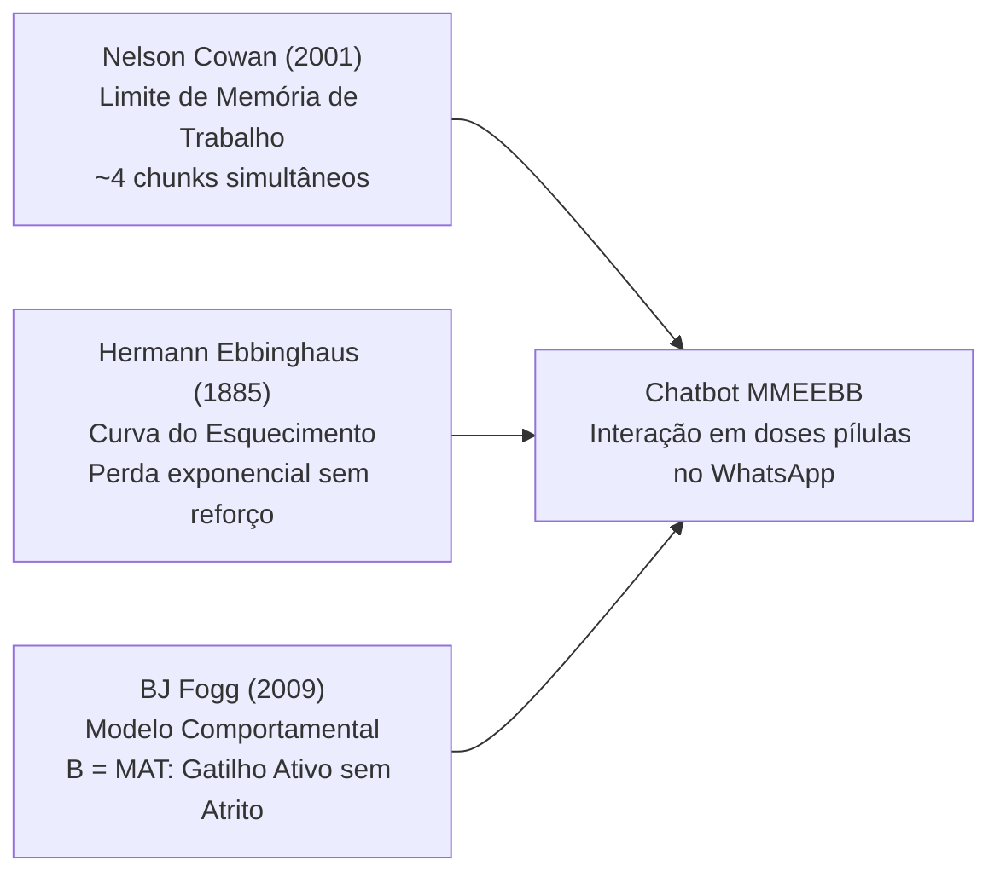
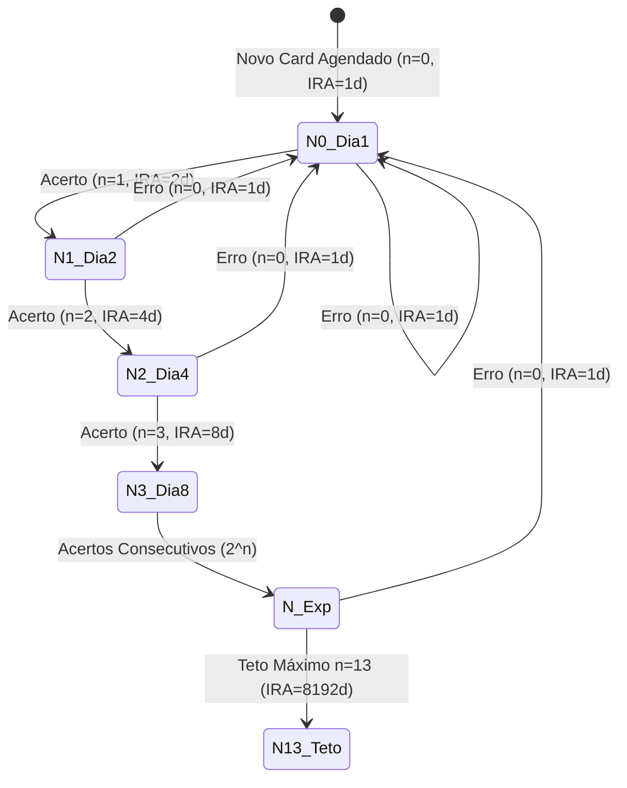
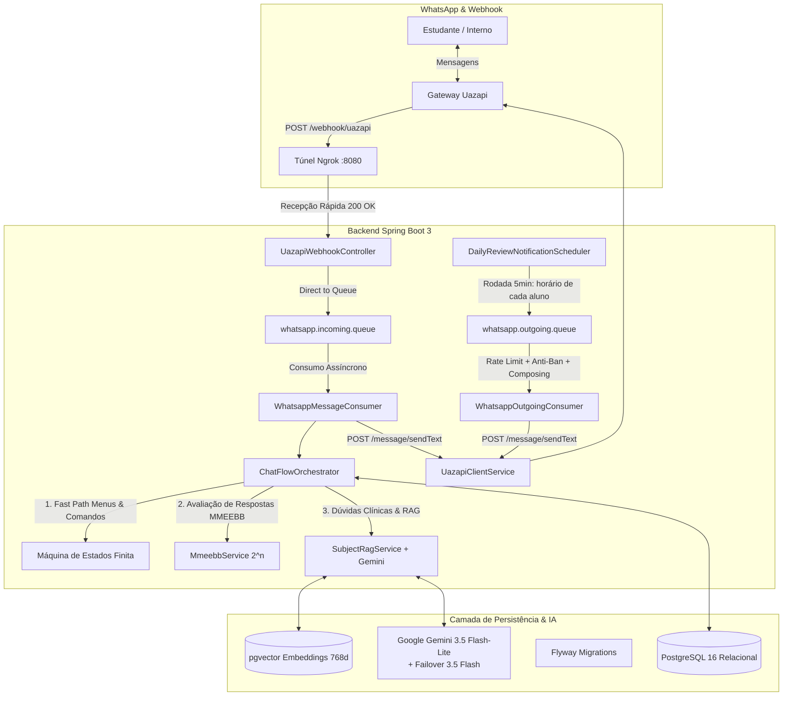
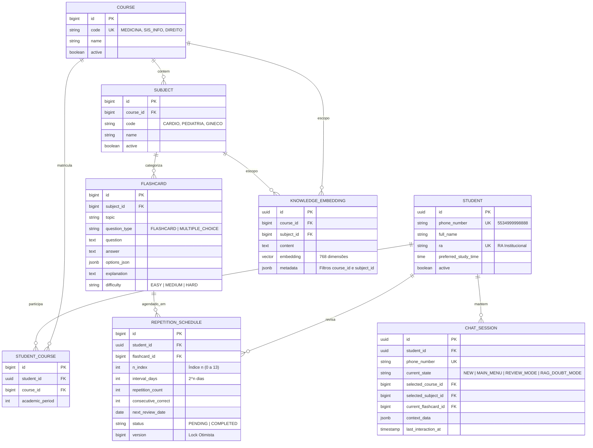

<div align="center">

# 🧠 Chatbot de Repetição Espaçada MMEEBB
### *Automação da Memorização Exponencial na Base Binária para Educação Médica e Superior*

[](https://openjdk.org/)
[](https://spring.io/projects/spring-boot)
[](https://github.com/pgvector/pgvector)
[](https://www.rabbitmq.com/)
[](https://ai.google.dev/)
[](https://github.com/langchain4j/langchain4j)
[](https://junit.org/junit5/)

---

**Trabalho de Conclusão de Curso (TCC)**  
**Instituição:** Centro Universitário de Patos de Minas ([UNIPAM](https://unipam.edu.br))  
**Curso:** Bacharelado em Sistemas de Informação  
**Autor:** Níckolas Tavares do Nascimento  
**Orientadora:** Profa. Dra. Mislene Dalila da Silva  

</div>

---

## 📌 Sumário
- [1. Visão Geral e Problema](#1-visão-geral-e-problema)
- [2. Fundamentação Teórica](#2-fundamentação-teórica)
- [3. O Algoritmo MMEEBB ($2^n$)](#3-o-algoritmo-mmeebb-2n)
- [4. Arquitetura da Solução](#4-arquitetura-da-solução)
- [5. Modelagem de Dados & DER](#5-modelagem-de-dados--der)
- [6. Stack Tecnológica](#6-stack-tecnológica)
- [7. Como Executar o Projeto](#7-como-executar-o-projeto)
- [8. Variáveis de Ambiente](#8-variáveis-de-ambiente)
- [9. Integração com WhatsApp (Uazapi & Ngrok)](#9-integração-com-whatsapp-uazapi--ngrok)
- [10. Suíte de Testes (TDD)](#10-suíte-de-testes-tdd)
- [11. Estrutura do Código](#11-estrutura-do-código)
- [12. Governança Git & Commits Semânticos](#12-governança-git--commits-semânticos)

---

## 1. Visão Geral e Problema

Estudantes de graduações densas — em especial os cursos de **Medicina** durante as fases de **Internato e Residência Médica** — enfrentam jornadas exaustivas que ultrapassam 40 a 60 horas semanais. Essa rotina gera dois desafios críticos:
1. **Sobrecarga Cognitiva e Fadiga:** Dificuldade extrema em encontrar tempo dedicado para abrir aplicativos tradicionais de estudo (como Anki ou flashcards manuais).
2. **Declínio Rápido da Retenção:** Conhecimentos clínicos e diagnósticos complexos são rapidamente esquecidos se não forem reforçados ativamente em intervalos matematicamente dosados.

Este projeto propõe e implementa um **Chatbot Inteligente no WhatsApp** que automatiza o agendamento de revisões ativas com o método **MMEEBB**, atua como um **Preceptor/Tutor Médico Virtual via IA Generativa (Google Gemini + RAG)** e elimina toda a fricção de uso ao entregar os questionamentos diretamente no canal de comunicação mais acessado pelo estudante.

---

## 2. Fundamentação Teórica

O projeto fundamenta-se na convergência de três pilares científicos e comportamentais:



1. **A Capacidade Mágica de Cowan (2001):** Demonstra que a atenção humana imediata comporta apenas $\approx 4$ blocos (*chunks*) de informação. O chatbot envia pílulas clínicas diárias que respeitam essa barreira cognitiva.
2. **A Curva do Esquecimento de Ebbinghaus (1885):** Mostra que a retenção cai drasticamente nas primeiras horas após o aprendizado. Revisões espaçadas ativas achatam a curva e consolidam as memórias de longo prazo.
3. **O Modelo Comportamental de BJ Fogg (2009) ($B = M \times A \times T$):** Um comportamento ($B$) só ocorre quando há Motivação ($M$), Habilidade/Facilidade ($A$) e Gatilho (*Trigger* - $T$). O chatbot atua como o **Gatilho Ativo (Push Notification)** dentro do WhatsApp, reduzindo o esforço do aluno a quase zero.

---

## 3. O Algoritmo MMEEBB ($2^n$)

O sistema utiliza o **Método de Memorização Exponencial Efetivo na Base Binária** (Ferreira et al., 2014):

### Fórmula do Intervalo de Reforço de Aprendizado (IRA):
$$\text{IRA} = 2^n \text{ dias}, \quad \text{onde } n \in [0, 13]$$



- **Início ($n = 0$):** O primeiro reforço ocorre $2^0 = 1$ dia após o contato com o conteúdo.
- **Acerto (Feedback Positivo):** O índice $n$ avança uma posição ($n \leftarrow \min(n+1, 13)$), dobrando o intervalo ($1 \to 2 \to 4 \to 8 \to 16 \dots$ dias).
- **Erro (Feedback Negativo):** O índice é resetado ($n \leftarrow 0$), retornando imediatamente para a fila de revisão do dia seguinte ($2^0 = 1$ dia).

---

## 4. Arquitetura da Solução

O sistema foi concebido sob o padrão **Direct-to-Queue Messaging** e **Arquitetura em Camadas Enterprise**, garantindo isolamento assíncrono, proteção contra sobrecargas e tolerância a falhas.



### 4.1. Máquina de Estados Finita (FSM) & Comandos Conversacionais

O fluxo conversacional é gerenciado por uma **FSM determinística** (`ChatFlowOrchestrator`) cujo estado vive no **Redis**, chaveado pelo número de WhatsApp e com TTL de expiração automática. O PostgreSQL guarda apenas o que é durável (estudante, matrícula e agendamentos), eliminando a escrita relacional a cada troca de estado.

#### Primeiro contato: formulário de cadastro

O número de WhatsApp é a chave única do estudante. Quando um número desconhecido envia a primeira mensagem, o bot aplica um formulário de três etapas antes de liberar o menu:

| Etapa | Estado da FSM | Campo coletado |
| :--- | :--- | :--- |
| 1 de 3 | `AWAITING_FULL_NAME` | Nome completo (exige nome e sobrenome) |
| 2 de 3 | `AWAITING_RA` | RA — aceita `pular`, e recusa RA já vinculado a outro número |
| 3 de 3 | `AWAITING_COURSE` → `AWAITING_ACADEMIC_PERIOD` | Curso e período letivo |

Ao concluir, o sistema grava `tb_student` + `tb_student_course` e **inicializa os agendamentos MMEEBB** de todos os flashcards ativos do curso, deixando a primeira rodada disponível imediatamente. Números já cadastrados nunca repetem o formulário, mesmo após a sessão expirar no Redis.

#### Após o cadastro: menu fixo + texto livre

O estudante pode usar os números do menu ou **escrever livremente**. Texto livre passa por um classificador de intenção (Gemini) que também extrai a disciplina citada e restringe a busca vetorial a ela:

| Intenção | Gatilhos | Comportamento |
| :--- | :--- | :--- |
| **📚 START_REVIEW** | `1`, ou texto livre como *"quero estudar um pouco"* | Inicia o ciclo de flashcards pendentes do dia ($2^n$). |
| **💡 ASK_DOUBT** | `2`, ou qualquer pergunta de conteúdo | Responde via RAG. Se a mensagem citar uma disciplina (*"dúvida de cardiologia"*), a busca é particionada por `subject_id`. |
| **🔄 CHANGE_SUBJECT** | `3`, ou *"quero trocar de matéria"* | Abre a seleção de curso e disciplina. |
| **📋 SHOW_MENU** | `menu`, `oi`, `bom dia`, `ajuda` | Reexibe o menu principal. |
| **🚪 EXIT** | `sair`, `tchau`, `encerrar`, `flw`, `/sair` | Finaliza a sessão com despedida e limpa o card ativo. |

> Durante o formulário de cadastro os comandos globais ficam desativados: `menu` ali é uma resposta possível do estudante, não um comando de reset.

#### Correção das respostas

Múltipla escolha é resolvida por comparação direta e também aceita a letra da alternativa colada por extenso pelo aluno (`"A) Inibidor de SGLT2..."`); respostas dissertativas passam por **correção semântica via Gemini**, que aceita o conceito correto expresso com palavras próprias e devolve um comentário pedagógico curto.

### 4.2. Resiliência do Gemini (Retry & Failover Automático)

O LangChain4j 0.35.0 usa por padrão um timeout rígido de 10s no `OkHttpClient` do cliente Gemini, insuficiente para respostas de RAG mais elaboradas. O `GeminiServiceCustomizer` (`dev.langchain4j.model.googleai`) substitui o `OkHttpClient` interno via reflection e adiciona:

- **Timeouts estendidos:** `connect`/`read`/`write`/`call` de 60s (`DEFAULT_TIMEOUT` em `LangChain4jConfig`), eliminando `SocketTimeoutException` em respostas mais longas do Tutor Clínico.
- **Interceptor de alta demanda (`HighDemandRetryInterceptor`):** intercepta HTTP `503` (High Demand) e `429` (Rate Limit) do Google, retentando até 3 vezes com backoff progressivo (800ms, 1600ms).
- **Failover dinâmico de modelo:** na penúltima tentativa, reescreve a URL da chamada Retrofit trocando `gemini-3.5-flash-lite` ↔ `gemini-3.5-flash` (clusters/pools separados no Google), aumentando a chance de sucesso sem intervenção manual.

---

## 5. Modelagem de Dados & DER

O banco de dados adota modelagem dinâmica multi-curso e multi-disciplina, particionando embeddings vetoriais para evitar cruzamento indevido de conteúdos no módulo RAG:



---

## 6. Stack Tecnológica

| Componente | Tecnologia | Finalidade |
| :--- | :--- | :--- |
| **Backend** | Java 17 + Spring Boot 3.3.x | Core da aplicação e regras de negócio |
| **Banco Relacional** | PostgreSQL 16 | Persistência transacional das entidades e agendamentos |
| **Banco Vetorial** | `pgvector` (PostgreSQL extension) | Armazenamento de embeddings semânticos para o RAG |
| **Migrations** | Flyway | Versionamento e automação do schema SQL |
| **Mensageria** | RabbitMQ 3 Management | Desacoplamento assíncrono, buffers e proteção anti-ban |
| **Estado Conversacional** | Redis 7 | FSM do chatbot com TTL, sem escrita relacional por mensagem |
| **IA / LLM & RAG** | Google Gemini 3.5 Flash-Lite (fallback 3.5 Flash) + LangChain4j 0.35.0 | Preceptor clínico, roteamento de intenção e RAG, com interceptor de retry/failover automático em 503/429 |
| **Parser Universal** | Apache Tika | Extração de texto de PDFs, DOCX e Markdown para ingestão |
| **Gateway WhatsApp** | Uazapi / UazapiGO | Conexão com o WhatsApp, webhooks e envio de mensagens |
| **Túnel Local** | Ngrok | Exposição segura da porta `8080` para recepção de eventos |
| **Testes** | JUnit 5, Mockito, Spring Test | Metodologia TDD com 100% de cobertura de serviços |

---

## 7. Como Executar o Projeto

### Pré-requisitos
- [Docker e Docker Compose](https://www.docker.com/)
- [Java Development Kit (JDK 17+)](https://adoptium.net/)
- [Ngrok CLI](https://ngrok.com/download)

### Passo 1: Subir os Containers Docker
Na raiz do repositório, execute:
```powershell
docker compose up -d
```
> Isso iniciará o **PostgreSQL 16 com pgvector** na porta `5432`, o **RabbitMQ** nas portas `5672` (AMQP) e `15672` (Painel Web: [http://localhost:15672](http://localhost:15672)) e o **Redis 7** na porta `6379`, usado para o estado conversacional do chatbot.
>
> Se a porta `5432` já estiver ocupada por outro Postgres na sua máquina, defina `POSTGRES_HOST_PORT=5433` (ou outra porta livre) no `.env` **antes** de subir os containers — o `docker-compose.yml` lê essa variável (`${POSTGRES_HOST_PORT:-5432}:5432`) e ajuste `SPRING_DATASOURCE_URL` de acordo.

### Passo 2: Configurar Variáveis de Ambiente (.env) e Rodar o Backend
Copie o modelo de ambiente ou edite o arquivo `.env` na raiz do projeto:
```powershell
Copy-Item .env.example .env
```
Preencha suas chaves no `.env`:
```properties
# Google Gemini (Chave gratuita em: https://aistudio.google.com/app/apikey)
GEMINI_API_KEY=sua_chave_gemini_aqui
GEMINI_MODEL_NAME=gemini-3.5-flash-lite
GEMINI_EMBEDDING_MODEL_NAME=gemini-embedding-001
GEMINI_TEMPERATURE=0.2

# Chave de Administração REST
ADMIN_API_KEY=teste

# Gateway Uaizap
UAZAPI_BASE_URL=https://free.uazapi.com
UAZAPI_API_KEY=sua_chave_uazapi
UAZAPI_INSTANCE=sua_instancia
# Opcional: só se você quiser que o painel /setup provisione instâncias sozinho (ver seção 9)
UAZAPI_ADMIN_TOKEN=
```

Em seguida, inicialize a aplicação:
```powershell
.\mvnw.cmd spring-boot:run
```

> **💡 Dica de Custo/Performance com Google Gemini:**  
> O modelo padrão configurado é o **`gemini-3.5-flash`** (ou `gemini-3.6-flash`), a geração mais moderna, econômica e de altíssima velocidade do Google. Para a geração de vetores semânticos do RAG, utilizamos o modelo oficial **`gemini-embedding-001`** configurado com `outputDimensionality: 768` (dimensões compatíveis com o índice HNSW do pgvector).

### Passo 3: Sincronizar Flashcards e Questões no RAG (pgvector)
Para que o tutor virtual responda a qualquer dúvida clínica ou técnica no WhatsApp com base no acervo de mais de 85 questões cadastradas, execute a sincronização via endpoint administrativo:

```powershell
curl.exe -i -X POST "http://localhost:8080/api/admin/rag/sync-flashcards" -H "X-API-KEY: teste"
```
*(Ou passe `?courseId=1` ou `?subjectId=1` para sincronizar uma disciplina específica).*

#### Cadastrando conteúdo por payload

Para indexar material novo sem depender de arquivos no servidor, envie o conteúdo no corpo da requisição. Curso, disciplina e tópico viram **metadados do embedding**, o que permite particionar a busca vetorial por matéria:

```powershell
curl.exe -i -X POST "http://localhost:8080/api/admin/rag/ingest" `
  -H "X-API-KEY: teste" -H "Content-Type: application/json" `
  -d '{
        "courseId": 1,
        "subjectId": 10,
        "topic": "Arritmias",
        "title": "Manejo da Fibrilação Atrial",
        "content": "Na FA com instabilidade hemodinâmica, a conduta é a cardioversão elétrica sincronizada..."
      }'
```

O texto é segmentado (300 tokens, overlap de 30) e cada trecho recebe `course_id`, `subject_id` e `topic`. A API valida que a disciplina informada pertence de fato ao curso informado.

### Passo 4: Conectar o WhatsApp (túnel, QR Code e webhook)

Suba o túnel (o painel ainda não inicia o processo do Ngrok sozinho, só detecta um já rodando):
```powershell
ngrok http 8080
```

**Caminho recomendado a partir daqui — painel web automático:** acesse **`http://localhost:8080/setup`** com a aplicação rodando. Ele detecta o túnel Ngrok ativo automaticamente, provisiona uma instância na Uazapi se necessário (usando `UAZAPI_ADMIN_TOKEN`), gera e exibe o QR Code, faz o pareamento por polling e sincroniza o webhook sozinho assim que a instância conecta — zero passo manual além de rodar o `ngrok http 8080` e escanear o QR. Detalhes completos na seção 9.

**Caminho 100% manual (fallback, sem o painel):** copie a URL pública HTTPS gerada pelo Ngrok (ex: `https://xxxx.ngrok-free.app`) e, no painel da Uazapi, configure:
- **Webhook URL:** `https://xxxx.ngrok-free.app/webhook/uazapi`
- **Eventos:** `messages.upsert` (ou `messages`)

---

## 8. Variáveis de Ambiente

| Variável | Valor Padrão | Descrição |
| :--- | :--- | :--- |
| `SPRING_DATASOURCE_URL` | `jdbc:postgresql://localhost:5432/mmeebb_db` | URL de conexão com o PostgreSQL |
| `SPRING_DATASOURCE_USERNAME` | `postgres` | Usuário do banco de dados |
| `SPRING_DATASOURCE_PASSWORD` | `postgres` | Senha do banco de dados |
| `POSTGRES_HOST_PORT` | `5432` | Porta do host mapeada pro Postgres no `docker-compose.yml` (mude se `5432` já estiver em uso) |
| `SPRING_RABBITMQ_HOST` | `localhost` | Host do RabbitMQ |
| `SPRING_RABBITMQ_PORT` | `5672` | Porta AMQP do RabbitMQ |
| `SPRING_RABBITMQ_USERNAME` | `guest` | Usuário do RabbitMQ |
| `SPRING_RABBITMQ_PASSWORD` | `guest` | Senha do RabbitMQ |
| `SPRING_REDIS_HOST` | `localhost` | Host do Redis (estado conversacional) |
| `SPRING_REDIS_PORT` | `6379` | Porta do Redis |
| `SPRING_REDIS_PASSWORD` | *(Vazio)* | Senha do Redis, se houver |
| `MMEEBB_SESSION_TTL_MINUTES` | `60` | Tempo de expiração da sessão conversacional no Redis |
| `MMEEBB_SCHEDULER_CRON` | `0 */5 * * * *` | Frequência das rodadas de lembrete; cada aluno recebe no horário definido em Configurações |
| `UAZAPI_BASE_URL` | `https://free.uazapi.com` | URL base do gateway da Uazapi |
| `UAZAPI_API_KEY` | *(Vazio)* | Token/Chave de autenticação da Uazapi |
| `UAZAPI_INSTANCE` | *(Vazio)* | Nome da instância do WhatsApp conectada |
| `UAZAPI_ADMIN_TOKEN` | *(Vazio)* | Admintoken da sua conta Uazapi (dashboard, **não** é a mesma coisa que `UAZAPI_API_KEY`) — habilita o botão "Provisionar Nova Instância" no painel `/setup` |
| `UAZAPI_TYPING_DELAY_MS` | `2000` | Delay simulado de digitação (*composing*) |
| `GEMINI_API_KEY` | *(Vazio)* | Chave de API do Google AI Studio (Gemini) |
| `GEMINI_MODEL_NAME` | `gemini-3.5-flash-lite` | Modelo de chat principal (failover automático para `gemini-3.5-flash` em picos de demanda) |
| `GEMINI_EMBEDDING_MODEL_NAME` | `gemini-embedding-001` | Modelo de embeddings do RAG (768 dimensões) |
| `GEMINI_TEMPERATURE` | `0.2` | Temperatura do modelo de chat (baixa, para respostas clínicas objetivas) |
| `ADMIN_API_KEY` | `teste` | Chave de segurança para endpoints `/api/admin/**` **e `/api/v1/setup/**`** (painel de conectividade) |
| `NGROK_CLIENT_API_URL` | `http://127.0.0.1:4040` | URL da API local de controle do Ngrok, usada pelo painel `/setup` para descobrir a URL pública do túnel |

---

## 9. Integração com WhatsApp (Uazapi & Ngrok)

### 9.1. Painel de Conectividade (`/setup`)

Conectar o bot ao WhatsApp manualmente (abrir o Ngrok, copiar a URL, colar no painel da Uazapi, gerar QR na mão) é um processo repetitivo e frágil para demonstrações — principalmente porque o **servidor demo gratuito da Uazapi (`free.uazapi.com`) expira instâncias automaticamente após 1 hora**. Para resolver isso, a aplicação expõe um painel web nativo em **`http://localhost:8080/setup`**, protegido pela mesma `ADMIN_API_KEY` dos endpoints `/api/admin/**`.

Fluxo do painel:
1. **Detecção do túnel**: consulta `GET http://127.0.0.1:4040/api/tunnels` (API local do Ngrok) para achar a URL pública ativa. Não inicia o processo do Ngrok sozinho — ele precisa estar rodando (`ngrok http 8080`).
2. **Provisionamento automático de instância** (`POST /api/v1/setup/instance/provision`): se não houver instância/token salvos (ou quando você clicar em "Provisionar Nova Instância"), a aplicação chama `POST /instance/init` na Uazapi com o **admintoken** da sua conta (`UAZAPI_ADMIN_TOKEN`, **diferente** do token de instância), recebe um token novo e salva **instância + token na tabela `system_configurations`** — não fica hardcoded em `.env`, então sobrevive a reinícios da aplicação mesmo trocando de instância a cada expiração de 1h.
3. **QR Code** (`POST /api/v1/setup/instance/connect`): chama `POST /instance/connect` com o token salvo, extrai `instance.qrcode` (já em `data:image/png;base64,...`) e exibe no painel com polling de status a cada 3s.
4. **Webhook automático**: assim que o polling detecta a instância `connected`, a aplicação configura o webhook sozinha (`POST /webhook` com a URL do Ngrok + eventos `messages.upsert`/`messages`) — idempotente, não reconfigura se já estiver apontando pra URL certa.
5. **Teste de fumaça**: botão dedicado dispara uma mensagem de teste real para o número informado.

### 9.2. Contrato real da API Uazapi

A documentação oficial (`docs.uazapi.com`) é uma SPA em JavaScript sem conteúdo acessível via scraping simples; o contrato abaixo foi confirmado testando diretamente contra `https://free.uazapi.com` (não por documentação lida):

| Ação | Rota | Header | Observação |
| :--- | :--- | :--- | :--- |
| Criar instância | `POST /instance/init` | `admintoken` | Body `{"name": "..."}`. Resposta traz `token` (novo) no root e em `instance.token`. |
| Conectar / obter QR | `POST /instance/connect` | `token` | **Sem** nome de instância na URL — o token sozinho identifica a instância. QR vem em `instance.qrcode`. |
| Consultar status | `GET /instance/status` | `token` | Estado em `instance.status` (`connecting`/`connected`/`disconnected`). |
| Configurar webhook | `POST /webhook` | `token` | Body `{"url", "events", "enabled"}`. |
| Desconectar / apagar | `POST /instance/disconnect` / `DELETE /instance` | `token` | Disconnect mantém a instância; delete remove de vez. |

### 9.3. Referência adicional (arquivos locais, não versionados)

`docs/GUIA_NGROK_WEBHOOK.md` e `docs/uazapi/UAZAPI_API_REFERENCE.md` existem no repositório de trabalho local mas **não são versionados** (`docs/` está no `.gitignore` — são notas de planejamento, não documentação pública). Se você tem o repositório clonado localmente com esses arquivos, eles cobrem o fluxo 100% manual passo a passo.

---

## 10. Suíte de Testes (TDD)

O projeto adota rigorosamente a metodologia **TDD (Test-Driven Development)** e testes de fumaça (*smoke tests*) em todas as camadas de serviço, controllers, DTOs e entidades.

Para executar a suíte completa de testes:
```powershell
.\mvnw.cmd test
```

### Resultados Atuais:
- **Total de Testes Unitários:** 213
- **Taxa de Aprovação:** 100% (0 Falhas, 0 Erros, 1 Ignorado)
- **Cobertura:** Cálculo matemático $2^n$, FSM de Sessões no Redis, formulário de cadastro, roteamento por intenção, correção semântica de respostas (inclusive por letra da alternativa), Tratamento de Intenção de Saída (*Exit Intent*), Ingestão e Sincronização RAG (particionada e global), Consumidores RabbitMQ, Notificações Ativas Push, Controladores Administrativos e **Painel de Conectividade Uazapi/Ngrok** (auto-descoberta de túnel, provisionamento de instância, QR Code, sincronização de webhook).

> O teste `RedisChatSessionStoreTest` valida a ida e volta do estado por um Redis real e é **ignorado automaticamente** quando não há Redis acessível (porta `6399` por padrão, configurável via `REDIS_IT_PORT`), mantendo a suíte executável sem dependências externas.

---

## 11. Estrutura do Código

```text
c:\projeto-tcc
├── src/main/java/br/edu/unipam/tcc/
│   ├── config/          # Beans Spring (RabbitMQ, LangChain4j, Redis, etc.)
│   ├── consumer/        # Consumidores AMQP (@RabbitListener)
│   ├── controller/      # Endpoints REST e Webhooks (/webhook/uazapi)
│   ├── dto/             # DTOs de transporte de dados e mapeamento Uazapi
│   ├── entity/          # Entidades relacionais JPA (Course, Student, etc.)
│   │   └── enums/       # ChatIntent, ChatState
│   ├── exception/       # GlobalExceptionHandler e exceções de domínio
│   ├── repository/      # Repositórios Spring Data JPA
│   ├── scheduler/       # Rotinas de disparo diário de revisões (@Scheduled)
│   ├── session/         # FSM conversacional no Redis (ChatSessionStore, ChatSessionState)
│   └── service/         # Interfaces e Implementações de regras de negócio
│       └── impl/        # ChatFlowOrchestrator, MmeebbService, SubjectRagService, IntentRouterService...
├── src/main/java/dev/langchain4j/model/googleai/
│   └── GeminiServiceCustomizer.java  # Timeout estendido + retry/failover 503/429 no cliente Gemini
├── src/main/resources/
│   ├── db/migration/    # Scripts SQL Flyway (V1__init_schema.sql em diante)
│   ├── static/setup/    # Painel web de conectividade Uazapi/Ngrok (index.html + js/setup.js)
│   └── application.yml  # Configurações do Spring Boot
├── docs/                # Especificações técnicas e manuais operacionais (local, não versionado)
│   ├── uazapi/          # Referência completa da API Uazapi
│   └── GUIA_NGROK_WEBHOOK.md
├── docker-compose.yml   # PostgreSQL 16 (pgvector) + RabbitMQ Management + Redis
└── pom.xml              # Dependências Maven do projeto
```

---

## 12. Governança Git & Commits Semânticos

O repositório adota o padrão **Conventional Commits**:

- `feat(escopo): descrição da nova funcionalidade`
- `fix(escopo): correção de bug`
- `test(escopo): adição ou melhoria de testes unitários`
- `docs(escopo): atualização de documentação ou especificações`
- `refactor(escopo): refatoração de código sem alteração de comportamento`
- `chore(escopo): tarefas de build, dependências ou configurações`

---

<div align="center">
  <sub>Desenvolvido com ☕ e dedicação por <b>Níckolas Tavares do Nascimento</b> — TCC UNIPAM 2026</sub>
</div>
