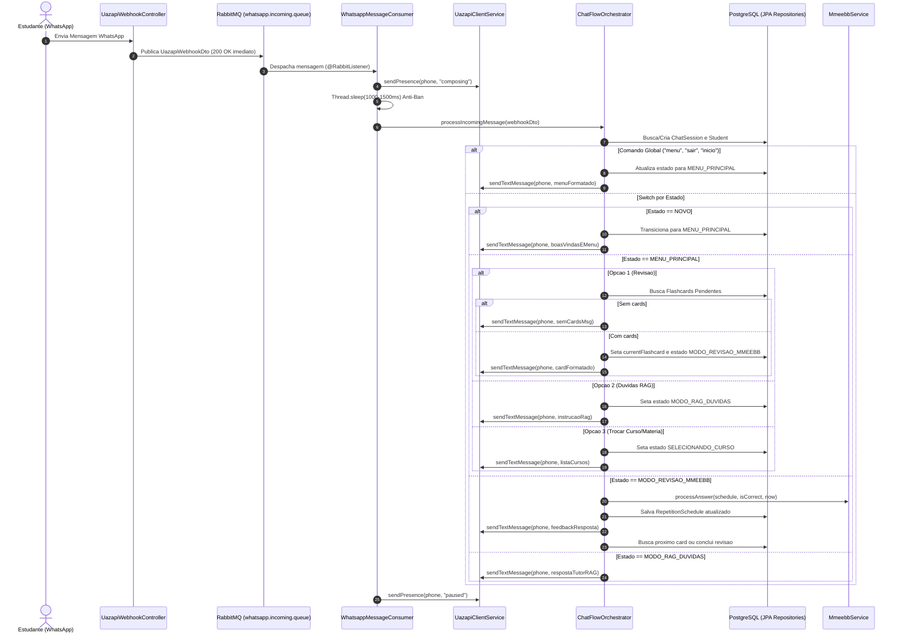

# Tech Spec: Máquina de Estados do Chatbot, Orquestrador de Fluxo e Consumidor RabbitMQ

| Metadado | Detalhe |
| :--- | :--- |
| **Data de Criação** | 2026-08-31 |
| **Status** | Aprovada |
| **Autor/Arquiteto** | Agente Arquiteto / Níckolas Tavares |
| **Módulo/Escopo** | `chat-flow-orchestrator` / `state-machine` / `messaging` |
| **Complexidade Estimada** | Média |

---

## 1. 🎯 Visão Geral e Justificativa (POR QUÊ)

### 1.1. Contexto do Problema
Estudantes e internos de medicina do UNIPAM necessitam de uma experiência conversacional fluida e reativa no WhatsApp para conduzir suas sessões de repetição espaçada (MMEEBB) e sanar dúvidas médicas. 
Para otimizar custos computacionais e latência, saudações, navegação de menu e seleção de opções determinísticas não devem acionar LLMs, sendo controladas por uma Máquina de Estados Finita (FSM). As chamadas a LLMs (via LangChain4j / Gemini) ficam restritas ao modo de dúvidas (RAG) e a avaliações semânticas complexas.

### 1.2. Objetivo
Construir o **núcleo conversacional (`ChatFlowOrchestrator`)** e integrar o **consumidor assíncrono do RabbitMQ (`WhatsappMessageConsumer`)** com a Máquina de Estados (`ChatState`), gerenciando a transição de contextos do aluno no WhatsApp com anti-ban, rastreabilidade transacional e pontos de extensão claros para o motor MMEEBB e o modo RAG.

### 1.3. Regras de Negócio Centrais
- **RN-01 (Resolução de Sessão e Estudante):** Ao receber uma mensagem, o sistema identifica ou cria a sessão (`ChatSession`) pelo telefone limpo do WhatsApp (`cleanPhoneNumber`). Se o estudante não existir, um cadastro inicial é provisionado.
- **RN-02 (Comandos Globais de Escape / Reset):** Comandos universais (`"menu"`, `"sair"`, `"inicio"`, `"começo"`, `"reset"`) resetam o estado conversacional imediatamente para `MENU_PRINCIPAL` e apresentam o menu de opções.
- **RN-03 (Máquina de Estados Finita):**
  - `NOVO`: Boas-vindas ao aluno, apresentação das funcionalidades e transição para `MENU_PRINCIPAL`.
  - `MENU_PRINCIPAL`: Processa escolhas numéricas (*1*: Revisão MMEEBB, *2*: Dúvidas RAG, *3*: Trocar Disciplina/Curso).
  - `MODO_REVISAO_MMEEBB`: Apresenta flashcards pendentes do dia (`nextReviewDate <= CURRENT_DATE`), recebe respostas, avalia com `MmeebbService` ($IRA = 2^N$) e avança até zerar o deck.
  - `MODO_RAG_DUVIDAS`: Ponto de extensão conversacional para perguntas abertas usando a base de conhecimento vetorial e LLM.
  - `SELECIONANDO_CURSO` / `SELECIONANDO_MATERIA`: Permite alternar o curso e a disciplina ativa do estudante.
- **RN-04 (Proteção Anti-Ban & Digitação Humana):** O consumidor simula presença `composing` com atraso controlado (1000ms a 1500ms) antes de processar e responder ao estudante.
- **RN-05 (Atualização de Timestamp):** Cada interação atualiza `lastInteractionAt` na sessão.

---

## 2. 🏛️ Arquitetura e Design da Solução

### 2.1. Diagrama de Fluxo / Sequência


### 2.2. Padrões Adotados
- **State Pattern / Finite State Machine**: Separação clara de comportamentos por estado conversacional.
- **Camadas**: `consumer` → `service` (`ChatFlowOrchestrator` / `ChatFlowOrchestratorImpl`) → `repository` → `entity` / `dto`.
- **Mensageria com RabbitMQ**: Desacoplamento do recebimento assíncrono com controle de concorrência e delays de segurança.
- **TDD (Test-Driven Development)**: Mockito + JUnit 5 cobrindo 100% das transições de estado e tratamento de exceções.

---

## 3. 🗄️ Modelagem de Dados & Enums

### 3.1. Atualização do Enum `ChatState`
```java
package br.edu.unipam.tcc.entity.enums;

public enum ChatState {
    NOVO,
    MENU_PRINCIPAL,
    SELECIONANDO_CURSO,
    SELECIONANDO_MATERIA,
    MODO_REVISAO_MMEEBB,
    MODO_RAG_DUVIDAS
}
```

### 3.2. Atualização das Entidades
- `ChatSession`: Inicializar com `currentState = ChatState.NOVO`.
- `V1__init_schema.sql`: Garantir default `DEFAULT 'NOVO'` na coluna `current_state`.

---

## 4. 📂 Arquivos Afetados

| Ação | Caminho do Arquivo | Descrição |
| :--- | :--- | :--- |
| `MODIFY` | `src/main/java/br/edu/unipam/tcc/entity/enums/ChatState.java` | Atualização dos enums em pt-BR |
| `MODIFY` | `src/main/java/br/edu/unipam/tcc/entity/ChatSession.java` | Ajuste do estado padrão inicial para `ChatState.NOVO` |
| `NEW` | `src/main/java/br/edu/unipam/tcc/service/ChatFlowOrchestrator.java` | Interface de orquestração de fluxo conversacional |
| `NEW` | `src/main/java/br/edu/unipam/tcc/service/impl/ChatFlowOrchestratorImpl.java` | Implementação do orquestrador com switch expression |
| `MODIFY` | `src/main/java/br/edu/unipam/tcc/consumer/WhatsappMessageConsumer.java` | Delegação para `ChatFlowOrchestrator` com `composing` e anti-ban |
| `NEW` | `src/test/java/br/edu/unipam/tcc/service/ChatFlowOrchestratorImplTest.java` | Testes unitários com Mockito para todas as transições de estado |
| `MODIFY` | `src/test/java/br/edu/unipam/tcc/consumer/WhatsappMessageConsumerTest.java` | Teste do consumidor com delegação ao orquestrador |
| `MODIFY` | `src/test/java/br/edu/unipam/tcc/entity/EntityInstantiationTest.java` | Atualização dos testes com `ChatState.NOVO` |

---

## 5. 🧪 Plano de Testes (TDD & Smoke Tests)

1. **Smoke Tests**:
   - `ChatFlowOrchestratorImplTest`: Validação de injeção de dependências e inicialização sem NPEs.
   - `WhatsappMessageConsumerTest`: Validação da delegação do payload deserializado.
2. **Testes Unitários da FSM (`ChatFlowOrchestratorImplTest`)**:
   - `deveProcessarNovoContatoECriarEstudanteESessao()`: Valida criação de `Student` e `ChatSession`, transição para `MENU_PRINCIPAL` e envio de boas-vindas.
   - `deveResetarParaMenuPrincipalQuandoReceberComandoGlobal()`: Valida comandos `"menu"`, `"sair"`, `"inicio"` a partir de qualquer estado.
   - `deveIniciarModoRevisaoQuandoSelecionarOpcao1NoMenu()`: Valida busca de cards pendentes e envio do primeiro card.
   - `deveInformarSemCardsQuandoNaoHouverPendenciasNoModoRevisao()`: Valida mensagem informativa quando o deck estiver zerado.
   - `deveProcessarRespostaAcertoNoModoRevisaoComMmeebb()`: Valida avaliação de acerto, dobra de intervalo $2^n$ e envio de feedback.
   - `deveProcessarRespostaErroNoModoRevisaoComMmeebb()`: Valida avaliação de erro, reset para $n=0$ (1 dia) e feedback pedagógico.
   - `deveTransicionarParaModoRagQuandoSelecionarOpcao2NoMenu()`: Valida ativação do modo de dúvidas.
   - `deveExibirMensagemOpcaoInvalidaQuandoOpcaoForDesconhecidaNoMenu()`: Valida robustez a entradas inválidas.
   - `deveTratarExcecoesComLogsEstruturadosSemDerrubarAplicacao()`: Valida resiliência a falhas no consumidor.

---

## 6. ⚠️ Riscos e Mitigações

| Risco | Severidade | Mitigação |
| :--- | :--- | :--- |
| Bloqueio por spam do WhatsApp (burst de mensagens) | Média | Simulação de presença `composing` e delay de 1000-1500ms antes da resposta. |
| Inconsistência em transições concorrentes de sessão | Baixa | Controle transacional `@Transactional` por mensagem e atualização atômica de `lastInteractionAt`. |
| Entradas com formatações atípicas no telefone | Baixa | Sanitização centralizada via `UazapiWebhookDto.getCleanPhoneNumber()`. |
