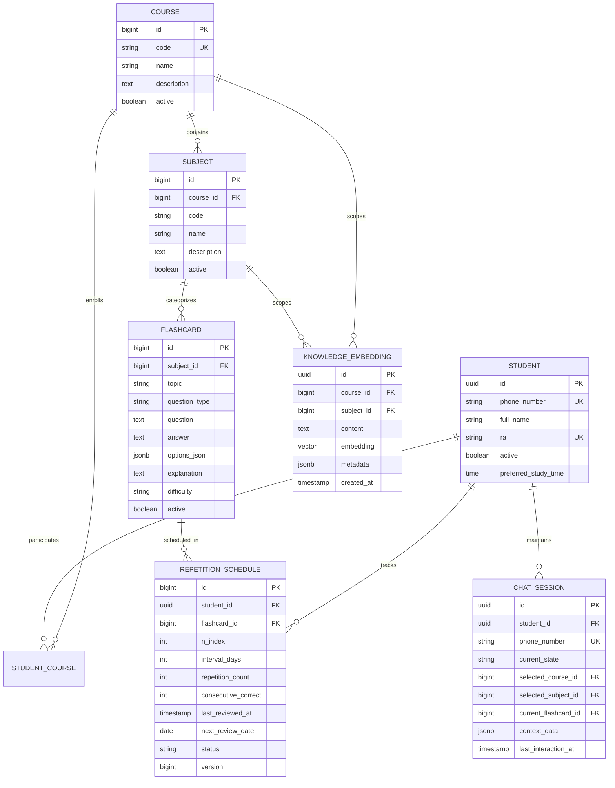
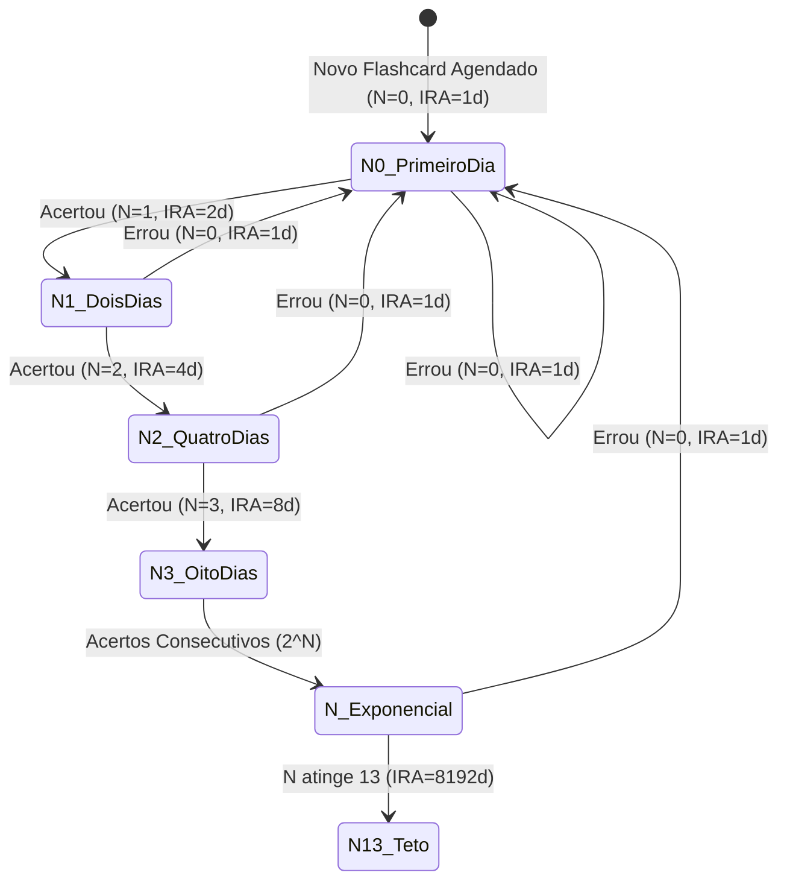

# Tech Spec: Core Dinâmico MMEEBB Multi-Curso & RAG Particionado

| Metadado | Detalhe |
| :--- | :--- |
| **Data de Criação** | 2026-08-31 |
| **Status** | Aprovada |
| **Autor/Arquiteto** | Agente Arquiteto / Níckolas Tavares |
| **Módulo/Escopo** | core-engine, schema-flyway, jpa-entities, mmeebb-service |
| **Complexidade Estimada** | Alta |

---

## 1. 🎯 Visão Geral e Justificativa (POR QUÊ)

### 1.1. Contexto do Problema
O projeto MMEEBB tem como objetivo mitigar a curva do esquecimento de Ebbinghaus através da repetição espaçada automatizada na base binária ($2^N$) e de um assistente de estudos no WhatsApp. Para que a plataforma atenda não apenas Medicina, mas qualquer graduação acadêmica (ex: Sistemas de Informação, Direito, Enfermagem), a modelagem deve ser desacoplada e dinâmica, permitindo:
1. Estruturação hierárquica e modular de Cursos, Matérias/Disciplinas e Flashcards/Questões.
2. Segmentação de RAG (Retrieval-Augmented Generation) com filtros de metadados no `pgvector` para que buscas semânticas fiquem restritas estritamente ao curso e matéria do estudante.
3. Máquina de estados conversacional no WhatsApp com baixo consumo de tokens de LLM nos fluxos determinísticos e menus de navegação.

### 1.2. Objetivo
Construir a base sólida do backend (Schema Flyway, Entidades JPA relacionais, Motor MMEEBB de cálculo $2^N$ e Suíte de Testes Unitários TDD), assegurando conformidade com as regras matemáticas do MMEEBB e suporte ao particionamento de IA.

### 1.3. Regras de Negócio Centrais
- **RN-01 (Fórmula do Intervalo IRA)**: O Intervalo de Reforço de Aprendizado é calculado por `IRA = 2^N` dias, onde $N \in [0, 13]$. Para $N=0$, $IRA = 1$ dia; para $N=1$, $IRA = 2$ dias; para $N=13$, $IRA = 8192$ dias.
- **RN-02 (Progressão de Acertos)**: Ao acertar uma revisão, $N$ é incrementado em 1 ($N \leftarrow \min(N + 1, 13)$), aumentando o intervalo exponencialmente a partir da data da resposta.
- **RN-03 (Penalidade e Reset de Erros)**: Ao errar ou relatar esquecimento, o contador é resetado ($N \leftarrow 0$) e o próximo ciclo volta imediatamente para $2^0 = 1$ dia.
- **RN-04 (Multi-Curso e Multi-Disciplina)**: Todo Flashcard pertence a uma Matéria (`Subject`), e toda Matéria pertence a um Curso (`Course`). O estudante pode se vincular a um ou mais cursos.
- **RN-05 (Isolamento de Metadados RAG)**: Embeddings no banco vetorial possuem metadados JSONB indexados (`course_id`, `subject_id`, `topic`) para permitir consultas com filtros semânticos isolados por disciplina.

---

## 2. 🏛️ Arquitetura e Design da Solução

### 2.1. Diagrama de Entidades e Relacionamentos

### 2.2. Diagrama de Transição de Estados do MMEEBB

---

## 3. 🗄️ Modelagem de Dados & Migration Flyway

### 3.1. Migration `V1__init_schema.sql`
- Cria extensões PostgreSQL: `uuid-ossp` e `vector`.
- Tabelas: `tb_course`, `tb_subject`, `tb_student`, `tb_student_course`, `tb_flashcard`, `tb_repetition_schedule`, `tb_chat_session`, `tb_knowledge_embedding`.
- Índices de performance:
  - Índices FK em todas as chaves estrangeiras.
  - Índices B-Tree em `tb_repetition_schedule(next_review_date, status)`.
  - Índices UNIQUE em `phone_number`, `ra`, `course_code`, `(course_id, subject_code)`, `(student_id, flashcard_id)`.
  - Índice GIN em `tb_knowledge_embedding(metadata)` para buscas eficientes de metadados JSONB.
  - Índice HNSW em `tb_knowledge_embedding(embedding vector_cosine_ops)`.

---

## 4. 📂 Arquivos Afetados

| Ação | Caminho do Arquivo | Descrição |
| :--- | :--- | :--- |
| `NEW` | `pom.xml` | Configuração Maven com Spring Boot 3.3.x, LangChain4j, PostgreSQL, pgvector, Flyway, RabbitMQ, Testcontainers |
| `NEW` | `src/main/resources/application.yml` | Configuração da aplicação Spring Boot |
| `NEW` | `src/main/resources/db/migration/V1__init_schema.sql` | Script Flyway com a modelagem relacional dinâmica e pgvector |
| `NEW` | `src/main/java/br/edu/unipam/tcc/MmeebbChatbotApplication.java` | Classe principal Spring Boot |
| `NEW` | `src/main/java/br/edu/unipam/tcc/entity/Course.java` | Entidade JPA Curso |
| `NEW` | `src/main/java/br/edu/unipam/tcc/entity/Subject.java` | Entidade JPA Matéria/Disciplina |
| `NEW` | `src/main/java/br/edu/unipam/tcc/entity/Student.java` | Entidade JPA Aluno |
| `NEW` | `src/main/java/br/edu/unipam/tcc/entity/StudentCourse.java` | Entidade JPA Matrícula/Vínculo Aluno-Curso |
| `NEW` | `src/main/java/br/edu/unipam/tcc/entity/Flashcard.java` | Entidade JPA Flashcard/Questão |
| `NEW` | `src/main/java/br/edu/unipam/tcc/entity/RepetitionSchedule.java` | Entidade JPA Agendamento MMEEBB com lock otimista |
| `NEW` | `src/main/java/br/edu/unipam/tcc/entity/ChatSession.java` | Entidade JPA Sessão e Máquina de Estados |
| `NEW` | `src/main/java/br/edu/unipam/tcc/entity/KnowledgeEmbedding.java` | Entidade JPA para vetores e metadados RAG |
| `NEW` | `src/main/java/br/edu/unipam/tcc/service/MmeebbService.java` | Interface do Motor MMEEBB ($2^N$) |
| `NEW` | `src/main/java/br/edu/unipam/tcc/service/impl/MmeebbServiceImpl.java` | Implementação das regras matemáticas e de agendamento MMEEBB |
| `NEW` | `src/test/java/br/edu/unipam/tcc/service/MmeebbServiceImplTest.java` | Suíte de testes unitários com JUnit 5 cobrindo 100% dos cenários do MMEEBB |

---

## 5. 🧪 Plano de Testes (TDD & Smoke Tests)

1. **Smoke Test**: Instanciação do `MmeebbServiceImpl` e validação do cálculo básico $2^0 = 1$.
2. **Cálculo de Intervalos ($N \in [0, 13]$)**:
   - $N=0 \implies 1$ dia
   - $N=1 \implies 2$ dias
   - $N=2 \implies 4$ dias
   - $N=3 \implies 8$ dias
   - $N=4 \implies 16$ dias
   - $N=5 \implies 32$ dias
   - $N=6 \implies 64$ dias
   - $N=7 \implies 128$ dias
   - $N=8 \implies 256$ dias
   - $N=9 \implies 512$ dias
   - $N=10 \implies 1024$ dias
   - $N=11 \implies 2048$ dias
   - $N=12 \implies 4096$ dias
   - $N=13 \implies 8192$ dias
3. **Casos Limítrofes e Saturação**:
   - $N > 13$ deve saturar em 13 ($8192$ dias).
   - $N < 0$ deve lançar `IllegalArgumentException`.
4. **Ciclo de Respostas**:
   - Acerto: incrementa $N$, dobra intervalo, atualiza `next_review_date`, incrementa `consecutive_correct` e `repetition_count`.
   - Erro: reseta $N \leftarrow 0$, intervalo volta a 1 dia, `consecutive_correct` zera, `repetition_count` incrementa.
   - Inicialização de novo agendamento: começa com $N=0$, intervalo de 1 dia para o dia seguinte.
