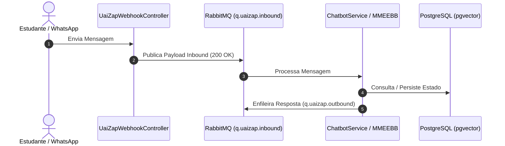

# Tech Spec: {{Nome da Funcionalidade}}

| Metadado | Detalhe |
| :--- | :--- |
| **Data de Criação** | {{YYYY-MM-DD}} |
| **Status** | Rascunho \| Em Revisão \| Aprovada \| Em Desenvolvimento \| Concluída |
| **Autor/Arquiteto** | Agente Arquiteto / Níckolas Tavares |
| **Módulo/Escopo** | {{ex: core-engine, uaizap-integration, unipam-ra, excel-import}} |
| **Complexidade Estimada** | Baixa \| Média \| Alta |

---

## 1. 🎯 Visão Geral e Justificativa (POR QUÊ)

### 1.1. Contexto do Problema
{{Descreva o problema médico, acadêmico ou técnico que esta funcionalidade resolve no contexto do internato/TCC.}}

### 1.2. Objetivo
{{Objetivo claro e mensurável da funcionalidade.}}

### 1.3. Regras de Negócio Centrais
- **RN-01**: {{Regra 1}}
- **RN-02**: {{Regra 2}}
- **RN-03**: {{Regra 3}}

---

## 2. 🏛️ Arquitetura e Design da Solução

### 2.1. Diagrama de Fluxo / Sequência


### 2.2. Padrões Adotados
- Camadas: `controller` → `service` (Interface + `ServiceImpl`) → `repository` → `entity` / `dto`.
- Mensageria: Padrão Direct-to-Queue com RabbitMQ.
- Persistência: JPA + Flyway migrations versionadas.

---

## 3. 🗄️ Modelagem de Dados & Banco

### 3.1. Novas Tabelas / Alterações
```sql
-- Migration: V{{N}}__{{descricao}}.sql
CREATE TABLE IF NOT EXISTS {{nome_tabela}} (
    id BIGSERIAL PRIMARY KEY,
    created_at TIMESTAMP WITHOUT TIME ZONE DEFAULT CURRENT_TIMESTAMP NOT NULL,
    updated_at TIMESTAMP WITHOUT TIME ZONE DEFAULT CURRENT_TIMESTAMP NOT NULL
);
```

### 3.2. Índices de Performance
```sql
CREATE INDEX IF NOT EXISTS idx_{{tabela}}_{{campo}} ON {{nome_tabela}}({{campo}});
```

---

## 4. 🔌 Contratos de API & Webhooks

### 4.1. Endpoint: `{{METODO}} /api/v1/{{rota}}`
- **Descrição**: {{O que o endpoint faz}}
- **Request Body**:
```json
{
  "campoExemplo": "valor"
}
```
- **Response Body (`200 OK`)**:
```json
{
  "sucesso": true,
  "dados": {}
}
```

---

## 5. 📂 Arquivos Afetados

| Ação | Caminho do Arquivo | Descrição |
| :--- | :--- | :--- |
| `NEW` | `src/main/resources/db/migration/V{{N}}__{{nome}}.sql` | Migration de banco de dados |
| `NEW` | `src/main/java/br/edu/unipam/tcc/entity/{{Entidade}}.java` | Entidade JPA |
| `NEW` | `src/main/java/br/edu/unipam/tcc/repository/{{Entidade}}Repository.java` | Repositório Spring Data |
| `NEW` | `src/main/java/br/edu/unipam/tcc/service/{{Nome}}Service.java` | Interface de serviço |
| `NEW` | `src/main/java/br/edu/unipam/tcc/service/impl/{{Nome}}ServiceImpl.java` | Implementação do serviço |
| `NEW` | `src/test/java/br/edu/unipam/tcc/service/{{Nome}}ServiceImplTest.java` | Testes unitários (TDD) |

---

## 6. 🧪 Plano de Testes (TDD & Smoke Tests)

1. **Smoke Test**: Validar instanciação do serviço e fiação no contexto Spring.
2. **Caminho Feliz**: {{Cenário 1}}
3. **Casos de Borda e Erros**:
   - Tratamento de campos nulos/inválidos (validação com `@Valid`).
   - Timeout de API externa / Fallback para modo offline.
   - Resiliência a duplicações de mensagens (idempotência).

---

## 7. ⚠️ Riscos e Mitigações

| Risco | Severidade | Mitigação |
| :--- | :--- | :--- |
| {{Risco 1}} | Alta \| Média \| Baixa | {{Mitigação}} |
| {{Risco 2}} | Alta \| Média \| Baixa | {{Mitigação}} |
